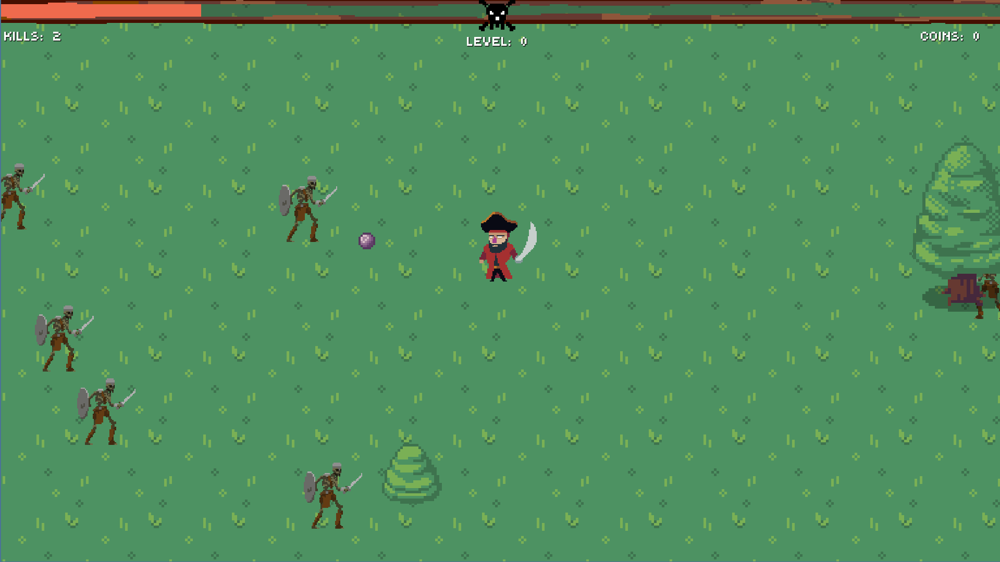

# Pirate of the lost sea

**Pirate of the lost sea** is a student project developed at **Leibniz University Hannover**, inspired by *Vampire Survivors* but set in a pirate-themed world. The goal was to create a fast-paced survival game experience using the Godot Engine.

> 🏴‍☠️ This project was created as part of a university team assignment.  
> I was actively involved in all parts of the development, including gameplay logic, scripting, and design decisions.

## ⚙️ Features
- Pirate-themed survival gameplay  
- Randomized enemy waves
- Level-up and upgrade mechanics
- Collect money and spend it for upgrades
- 2D pixel-art style  
- Built entirely in **Godot Engine** using **GDScript**

## 🧩 Technologies Used
- **Godot Engine 4.3**  
- **GDScript**  

## 🚀 How to Run
1. Download or clone the repository.  
2. Open the project in **Godot Engine (version 4.3 recommended)**.  
3. Run the main scene to start the game.  

## 🏫 Project Background
This project was developed as part of the module "Einführung in die Spieleentwicklung" at **Leibniz University Hannover**.  
It served as a collaborative exercise in game development, covering programming, design, and project management within a small student team.

## 👤 Authors
Developed collaboratively by me and two other students of **Leibniz University Hannover**.  
Contributions include programming, design, and gameplay systems.  
